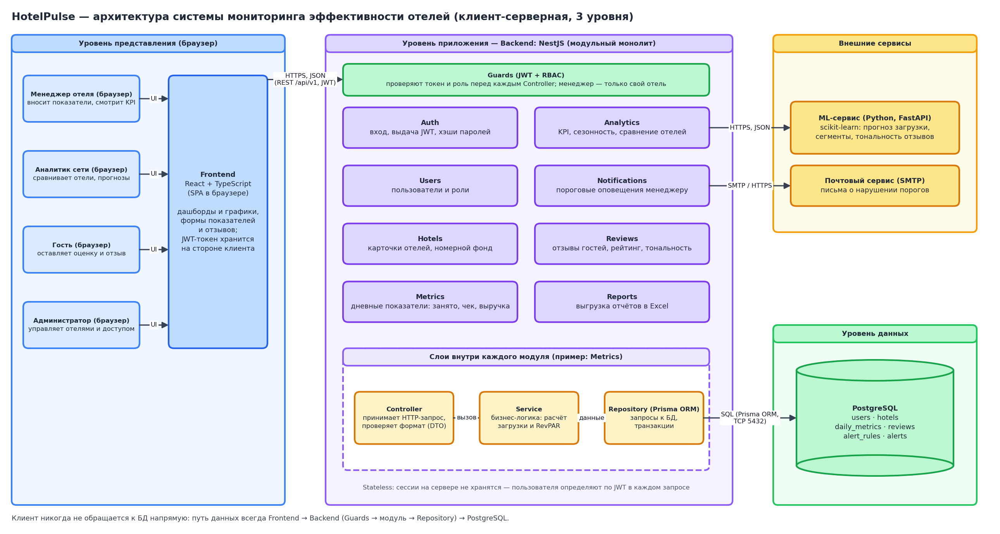
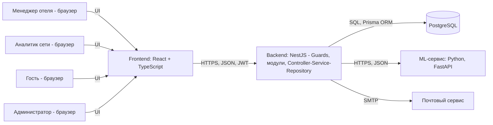

# HotelPulse — мониторинг и оценка эффективности работы отелей

Лабораторная работа № 1 «Проектирование архитектуры клиент-серверного приложения».
Предметная область: вариант № 8 — загрузка номеров, средний чек, сезонность, отзывы и рейтинги гостей.

## Описание системы

HotelPulse — web-система мониторинга эффективности отелей. Менеджер отеля ежедневно вносит показатели (сколько номеров занято, средний чек, расходы на маркетинг, долю отмен), а система сама считает загрузку и RevPAR и показывает их динамику и сезонность. Аналитик сети сравнивает отели между собой, видит рейтинг отелей по RevPAR и прогноз загрузки на ближайшие недели, который считает отдельный ML-сервис. Гость оставляет оценку и текстовый отзыв, а система определяет тональность отзыва и пересчитывает рейтинг отеля. Если загрузка или рейтинг опускаются ниже заданного порога, менеджер получает письмо. Система заменяет ручные Excel-таблицы и пересылку отчётов по почте: данные хранятся в одном месте, а права разграничены — менеджер видит и меняет только свой отель, аналитик видит все отели, но не может менять показатели.

**Роли:** менеджер отеля, аналитик сети, гость, администратор.
**Сущности:** пользователь (User), отель (Hotel), дневной показатель (DailyMetric), отзыв (Review), правило оповещения (AlertRule), оповещение (Alert). Связи: у отеля один менеджер и много дневных показателей, отзывов и правил; оповещение создаётся, когда новый показатель нарушает правило.
**Операции (13):** вход в систему; создание и изменение отеля; назначение менеджера отелю; ввод показателей за день; загрузка показателей файлом CSV; просмотр KPI и динамики отеля; сравнение отелей; просмотр сезонности; запрос прогноза загрузки; оставление отзыва; просмотр отзывов и их тональности; настройка порога оповещения; выгрузка отчёта в Excel.

## Команда 

Момунов Акыл(GitHub: momunchall), группа ПИ-2-23 (индивидуальная работа).

## Роли и сценарии

| ID | Роль | Сценарий | Результат |
| --- | --- | --- | --- |
| UC1 | Менеджер отеля | Вносит показатели за день: занято номеров, средний чек, маркетинг, отмены | Показатели сохранены, рассчитаны загрузка и RevPAR, проверены пороги оповещений |
| UC2 | Менеджер отеля | Открывает динамику загрузки и среднего чека своего отеля за выбранный период | KPI-карточки и график по месяцам |
| UC3 | Аналитик сети | Сравнивает отели по RevPAR и загрузке, смотрит сезонность | Рейтинг отелей и тепловая карта «отель × месяц» |
| UC4 | Аналитик сети | Запрашивает прогноз загрузки отеля на N дней | График «факт + прогноз» от ML-сервиса |
| UC5 | Гость | Оставляет оценку (1–5) и текст отзыва об отеле | Отзыв сохранён, определена тональность, рейтинг отеля пересчитан |
| UC6 | Менеджер отеля | Задаёт порог загрузки или рейтинга для оповещений | При нарушении порога приходит письмо |
| UC7 | Администратор | Создаёт отель и назначает ему менеджера | Отель появился в системе, менеджер видит только его |

## Архитектура

Исходник схемы: `docs/architecture.drawio` (открывается на app.diagrams.net).
Подробное описание компонентов: [docs/components.md](docs/components.md)
Жизненный цикл запроса: [docs/request-lifecycle.md](docs/request-lifecycle.md)

Та же схема в текстовом виде (Mermaid, отображается прямо на GitHub):

## Обоснование решений

**1. Почему трёхуровневая архитектура и что было бы при прямой работе клиента с БД.**
Выбраны три уровня: интерфейс (React), приложение (NestJS), данные (PostgreSQL), потому что правила системы должны выполняться в одном доверенном месте — на сервере. Если бы браузер обращался к базе напрямую, в клиенте пришлось бы хранить пароль от БД, любой менеджер мог бы прочитать показатели чужого отеля, а некорректные данные (например, «занято 180 номеров при 110 в отеле») ничто не отсекало бы. Кроме того, любое изменение структуры таблиц ломало бы клиент.

**2. Какие данные хранятся в БД, а какие у клиента.**
В PostgreSQL хранятся пользователи (с хэшами паролей), отели, дневные показатели, отзывы, правила оповещений и сами оповещения — всё, что должно сохраняться между сессиями и быть общим для всех. У клиента хранится только JWT-токен (подписанный сервером, содержит идентификатор пользователя и роль) и состояние интерфейса: выбранный отель, период, фильтры. Если пользователь очистит браузер, он потеряет только токен и войдёт заново, а данные останутся.

**3. Где применён stateless и как сервер узнаёт, кто отправил запрос.**
Backend не хранит сессий в памяти: каждый запрос несёт заголовок `Authorization: Bearer <JWT>`, Guard проверяет подпись и срок токена и берёт из него пользователя и роль. Благодаря этому в конце месяца, когда менеджеры одновременно загружают отчёты, можно запустить несколько экземпляров backend, и любой из них обработает любой запрос. Если бы сессии хранились в памяти сервера, пользователь был бы привязан к одному экземпляру, а при его перезапуске все потеряли бы вход.

**4. Почему монолит и когда стоило бы разделять.**
Выбран модульный монолит: проект ведёт один разработчик, а операция «сохранить показатель и сразу проверить порог» должна выполняться атомарно в одной транзакции БД, что в монолите проще, чем между сервисами. Границы модулей (Metrics, Reviews, Analytics, Notifications) уже заложены, поэтому выделить сервис позже будет несложно. Разделять стоило бы, если аналитические расчёты начнут тормозить приём данных или появится отдельная команда. ML-часть вынесена в отдельный сервис сразу: она написана на Python (scikit-learn), имеет собственный жизненный цикл (переобучение моделей) и не должна влиять на приём показателей.

**5. Какие проверки выполняются на сервере и почему не только на клиенте.**
Сервер проверяет: подлинность токена и роль; что менеджер работает только со своим отелем; что `0 ≤ занято ≤ номеров в отеле` и чек положительный (ошибки такого рода — занято больше номеров, чем есть, или чек с лишним нулём — встречались в данных, которые мы чистили в лабораторной по анализу данных); что за день записан только один показатель на отель (ограничение `UNIQUE (hotel_id, date)`); что оценка отзыва лежит в диапазоне 1–5. Проверки на клиенте нужны лишь для удобства (быстрое сообщение об ошибке), но обойти их можно, отправив запрос напрямую через curl или инструменты разработчика, поэтому защитой они не являются.

## Риски

| Риск | Место на схеме | Последствие | Как снизить |
| --- | --- | --- | --- |
| ML-сервис недоступен | Analytics → ML-сервис | Нет прогноза и тональности отзывов | Таймаут вызова, показ последнего сохранённого прогноза, остальной дашборд работает; тональность проставляется отложенно при повторной попытке |
| Менеджер ввёл ошибочные данные (чек в 10 раз выше, занято больше номеров, чем есть) | Frontend → Metrics → БД | Искажённые KPI и ложные оповещения | Проверка DTO на сервере, `CHECK`-ограничения в БД, предупреждение при отклонении чека более чем в 3 раза от медианы отеля, журнал изменений |
| Подбор или кража пароля, доступ к чужому отелю | Auth, Guards | Утечка коммерческих показателей | Хэширование паролей (bcrypt), ограничение числа попыток входа, короткий срок жизни JWT, проверка принадлежности отеля в Guard, только HTTPS |
| Недоступна или потеряна база данных | Repository → PostgreSQL | Система не работает, потеря показателей | Ежедневные резервные копии, транзакции, мониторинг доступности БД |
| Накрутка и спам отзывов | Reviews | Искажённый рейтинг отеля | Один отзыв на гостя и отель, ограничение частоты запросов, модерация отзывов |
| Пик нагрузки при массовой загрузке CSV | Metrics → БД | Медленная работа для всех | Пакетная вставка, индекс по `(hotel_id, date)`, фоновая обработка файла, несколько экземпляров backend (возможно благодаря stateless) |
