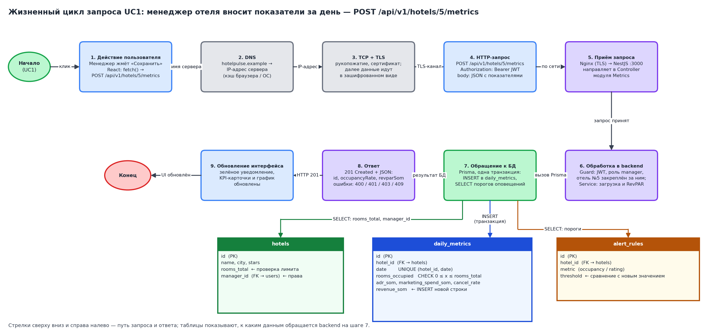

# Жизненный цикл запроса

**Сценарий UC1: менеджер отеля вносит показатели за день.**
Пример: отель №5 (110 номеров), дата 05.10.2026, занято 74 номера, средний чек 7 450 сом, маркетинг 2 100 сом, отмены 9 %.



Исходник схемы: `request-flow.drawio`.

## Девять шагов

1. **Действие пользователя.** Менеджер заполняет форму «Показатели за день» и нажимает «Сохранить». React вызывает `fetch()` с запросом `POST /api/v1/hotels/5/metrics`.
2. **DNS.** Браузер узнаёт IP-адрес сервера по имени `hotelpulse.example`. Если адрес недавно запрашивался, он берётся из кэша браузера или операционной системы.
3. **Соединение (TCP/TLS).** Браузер устанавливает TCP-соединение и выполняет TLS-рукопожатие: проверяет сертификат сервера и договаривается о ключах. Дальше данные передаются в зашифрованном виде.
4. **HTTP-запрос.**
   ```
   POST /api/v1/hotels/5/metrics HTTP/1.1
   Host: hotelpulse.example
   Content-Type: application/json
   Authorization: Bearer <JWT менеджера>

   {"date": "2026-10-05", "roomsOccupied": 74, "adrSom": 7450, "marketingSpendSom": 2100, "cancelRate": 0.09}
   ```
   Идентификатор пользователя в теле запроса не передаётся: сервер берёт его из токена.
5. **Приём запроса.** Запрос принимает веб-сервер Nginx (он расшифровывает TLS) и передаёт его приложению NestJS на порту 3000, где его получает Controller модуля Metrics.
6. **Обработка в backend.**
   - Guard проверяет подпись и срок JWT, роль `manager` и то, что отель №5 закреплён за этим менеджером (`hotels.manager_id` = id из токена).
   - Controller проверяет формат тела запроса (DTO): типы полей, `0 ≤ roomsOccupied`, `adrSom > 0`.
   - Service получает из БД номерной фонд отеля (110 номеров), проверяет `74 ≤ 110`, считает загрузку 74 / 110 = 0,673 и RevPAR = 74 × 7 450 / 110 ≈ 5 012 сом.
   - Service передаёт новый показатель в модуль Notifications для проверки порогов.
7. **Обращение к БД.** Prisma в одной транзакции выполняет `INSERT` в `daily_metrics` и `SELECT` правил из `alert_rules` для отеля №5. Ограничение `UNIQUE (hotel_id, date)` не даст записать второй показатель за тот же день, а `CHECK` не пропустит недопустимое число занятых номеров.
8. **Ответ.** Backend возвращает `201 Created` и JSON: `{"id": 4817, "date": "2026-10-05", "occupancyRate": 0.673, "revparSom": 5011.8}`. Возможные ошибки: `400` (неверные данные), `401` (нет или недействителен токен), `403` (чужой отель), `409` (показатель за эту дату уже есть). Если порог нарушен, Notifications в фоне отправляет менеджеру письмо через SMTP, не задерживая ответ.
9. **Обновление интерфейса.** React получает ответ, показывает уведомление «Показатели за 05.10.2026 сохранены», обновляет KPI-карточки и добавляет новую точку на график динамики.

## Как сервер узнаёт, кто отправил запрос

Сервер не хранит сессию. В каждом запросе есть JWT, подписанный секретным ключом сервера; в нём записаны идентификатор пользователя и роль. Guard проверяет подпись и срок действия, поэтому подделать роль в токене невозможно: изменённый токен не пройдёт проверку подписи.

## Таблицы БД, участвующие в запросе

| Таблица | Операция на шаге 7 | Зачем |
| --- | --- | --- |
| hotels | SELECT `rooms_total`, `manager_id` | Проверить лимит номеров и право менеджера на отель |
| daily_metrics | INSERT | Сохранить показатель за день |
| alert_rules | SELECT | Найти пороги, которые нужно сравнить с новым показателем |
